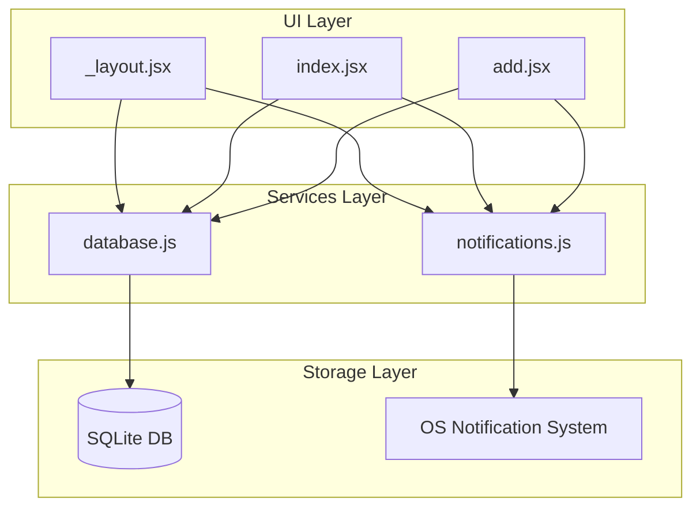

# System Patterns: SubTracker

## Architecture Overview



## Key Patterns

### 1. Centralized Notification Management

All notification logic is centralized in `utils/notifications.js`:

- `setupNotificationHandler()` - Configure foreground display
- `requestNotificationPermissions()` - Handle permissions
- `scheduleSubscriptionNotification()` - Schedule per subscription
- `cancelSubscriptionNotification()` - Cancel on delete
- `rescheduleAllNotifications()` - Sync on app launch

### 2. App Launch Synchronization

On every app launch (`_layout.jsx`):

1. Initialize database
2. Request notification permissions
3. Fetch all subscriptions
4. Reschedule all notifications

This ensures notifications stay in sync even if the user didn't confirm payments through the app.

### 3. Database Module Pattern

`database.js` exports pure async functions:

```javascript
export const getSubscriptions = async () => { ... }
export const addSubscription = async (name, amount, date, categoryId) => { ... }
export const deleteSubscription = async (id) => { ... }
```

No global state - database connection managed internally.

### 4. Component Composition

| Component     | Responsibility                                 |
| ------------- | ---------------------------------------------- |
| `_layout.jsx` | Root setup, splash, DB init, notification sync |
| `index.jsx`   | Subscription list, payment confirmation modal  |
| `add.jsx`     | Form for new subscriptions                     |

## Design Decisions

### SQLite Over AsyncStorage

- **Why**: Complex relational data (subscriptions ↔ categories ↔ history)
- **Benefit**: SQL queries, foreign keys, structured schema

### Local Notifications Only

- **Why**: Privacy-first, no backend needed
- **Trade-off**: Notifications may not fire if app is uninstalled

### No State Management Library

- **Why**: Simple app with limited shared state
- **Pattern**: Local `useState` + callback props
